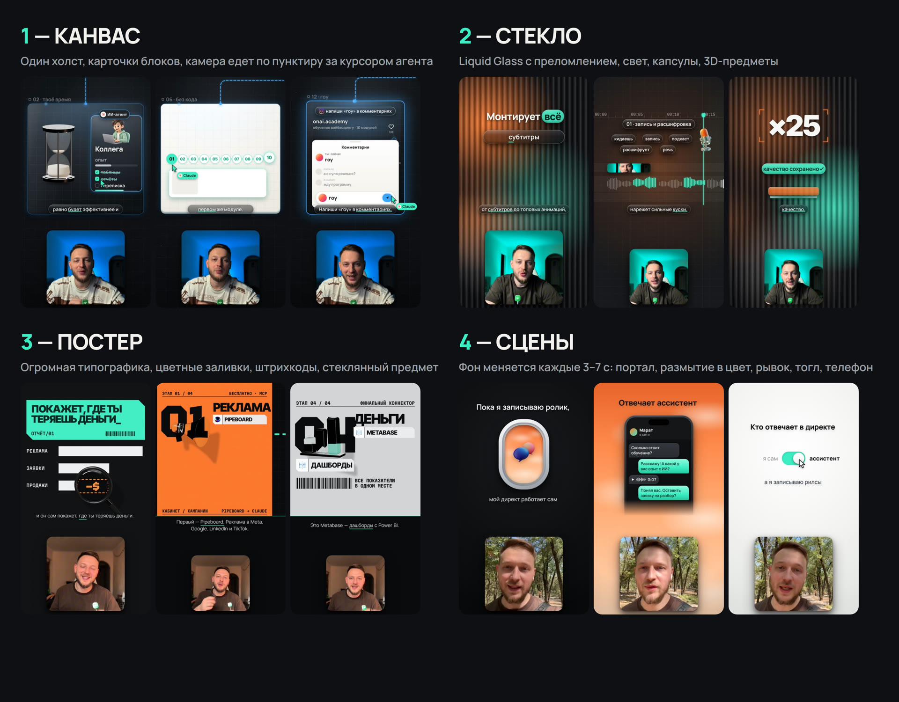
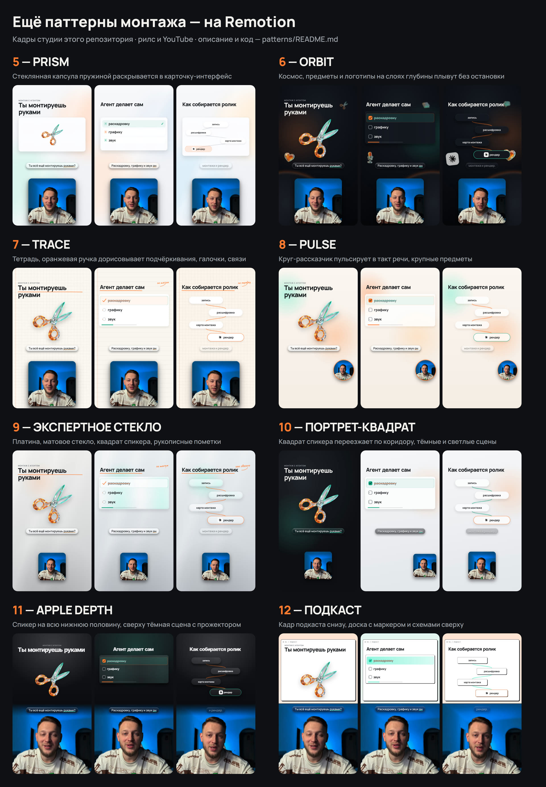

# Старт за 10 минут — для тех, кто пришёл из рилса

Этот репозиторий — пайплайн монтажа роликов, на котором собираются ролики [@saint4ai](https://instagram.com/saint4ai):
**рилсы 9:16** (Instagram, Shorts, TikTok) и **ролики для YouTube 16:9**. Монтирует агент у тебя на компьютере: Claude в обычном
чате видео не отрендерит, а здесь всё собирается локально — React-сцены на **Remotion** → MP4, каждый блок сначала проверяется
в витрине **Storybook**.

Ничего не ставь руками через терминал: отдай ссылку Claude, он поставит сам. Руками — только регистрация, подписка и ключи доступа.

## 1. Что нужно

- Компьютер: Windows с WSL, macOS или Linux. Чем больше ядер процессора — тем быстрее рендер.
- Приложение Claude для компьютера — [claude.ai/download](https://claude.ai/download), подписка **Pro или Max**;
  после установки открой вкладку **Code**.
- Или Codex от OpenAI — подписка **ChatGPT Plus или Pro**; для Codex в репозитории есть `AGENTS.md`, всё остальное так же.

## 2. Установка — одним сообщением агенту

Открой вкладку Code (в Codex — новый чат), выбери пустую папку для проектов и отправь:

```text
Склонируй https://github.com/saint4ai/reels-pipline-automotaj и подготовь всё по SETUP.md: запусти
scripts/bootstrap-portable.sh, поставь то, чего не хватает (Node.js 22+, ffmpeg, Python 3), студию в studio/
(npm ci и браузер рендера Remotion) и проверь, что node scripts/qa-fit.mjs FitTest падает, а Template-Reels проходит.
Почини, что не работает. Потом открой папку репозитория, прочитай CLAUDE.md и docs/agent-contract/WORKFLOW.md
и сразу начни: спроси, рилс это или ролик для YouTube, покажи стили монтажа картинкой и веди опрос по одному вопросу.
```

## 3. Что будет дальше

Агент сам ведёт по шагам и ждёт твоего ответа на каждом:

1. **Формат** — покажет картинку и спросит: рилс (9:16) или ролик для YouTube (16:9).

   

2. **Стиль монтажа** — покажет настоящие кадры и спросит, какой берём: 1 — КАНВАС, 2 — СТЕКЛО, 3 — ПОСТЕР, 4 — СЦЕНЫ,
   один из паттернов 5–12 прошлых роликов или свой стиль под этот ролик.

   

   

3. **Опрос** — по одному вопросу: о чём ролик, есть ли текст и запись, дашь ли скриншоты и материалы, есть ли референсы, как сдать.
4. **Текст** — если текста нет, напишет сам: ресёрч, черновик и три скептика (эксперт-зритель, копирайтер прямого отклика,
   редактор удержания), потом покажет финальный текст.
5. **Монтаж** — карта монтажа, сборка в студии, проверка контейнеров.
6. **Листы кадров** каждые 2 секунды с номерами К001, К002… — ты правишь словами, рендер только после твоего «да».
7. **Рендер** 2K и выравнивание громкости до −14 LUFS.

## 4. Скажи Claude, кто теперь владелец

Правила писались под автора, поэтому в них встречается «Александр». Отправь:

```text
В правилах этого репозитория «Александр» — это владелец проекта. Теперь владелец — я:
вопросы по формату, стилю и приёмке задавай мне.
```

## 5. Сними запись

- **Рилс:** вертикально 9:16, лучше 1080×1920 или 4K.
- **YouTube:** горизонтально 16:9 с камеры или вертикально с телефона — карточка спикера сама впишет запись по лицу.
- Свет на лицо, петличный микрофон. Не обрезай и не ускоряй — пайплайн работает с исходником как есть.
- Говори по готовому тексту: на каждую фразу агент подберёт действие в кадре.

## 6. Референсы: как собирать

1. Найди 2–3 ролика, которые нравятся **монтажом**, а не темой. Сохрани видео.
2. Положи в `reference/inbox/` и отправь:

```text
Разбери референс reference/inbox/<файл> по образцу reference/breakdowns/2026-09-02-ref-0902-claude-limits.md:
структура по времени, раскладка, подложка, шрифты, переходы, ритм. Сохрани в reference/breakdowns/<дата>-<имя>.md.
```

3. При монтаже: «Возьми за основу разбор <файл>, но тексты и тема — мои».

## 7. Кадры и правки

```text
Покажи листы кадров каждые 2 секунды.
```

Правки пиши обычными словами и по номерам кадров: «К007 — субтитры крупнее», «на 12 секунде логотип раньше».
Агент правит и показывает новые кадры.

## 8. Рендер

```text
Всё ок, рендерь.
```

Готовый ролик — в `videos/<проект>/renders/final.mp4`. Перед отправкой агент проверит кадры самого MP4 и громкость.

## Как не сжечь подписку

- Один ролик — одна сессия; длинные сессии закрывай и начинай новую — всё состояние лежит в файлах проекта.
- Не проси показывать кадры по одному — только листами.
- Не проси «прочитай весь проект»: агенту хватает `CONTEXT.md` и файлов ролика.

Метод и код — MIT, условия в [LICENSE](LICENSE) и [NOTICE](NOTICE). Автор — onAI Academy, @saint4ai.

## Что делать, если агент сразу выдал простое видео с субтитрами

Значит, он не прочитал инструкции репозитория. Проверь три вещи:

1. **Рабочая папка** — в Claude Code должна быть открыта сама папка `reels-pipline-automotaj`, а не папка уровнем выше:
   иначе `CLAUDE.md` не подхватывается и агент не знает про опрос и студию.
2. **Модель** — нужен Opus с усилием xhigh (в Codex `gpt-5.6-sol`, `model_reasoning_effort = "xhigh"`).
   На слабой модели получается ровно «субтитры поверх видео».
3. **Сообщение агенту** — отправь это:

```text
Прочитай в этой папке CLAUDE.md, CONTEXT.md и docs/agent-contract/WORKFLOW.md. Работай строго по WORKFLOW:
сначала спроси, рилс это или ролик для YouTube (покажи reference/style-previews/formats.jpg), потом покажи стили монтажа
картинками reference/style-previews/styles.jpg и more-styles.jpg и дождись выбора, потом опрос по одному вопросу, текст, монтаж в studio/
на Remotion и листы кадров каждые 2 секунды. Без моего «да» на кадры ничего не рендери.
```

В Claude Code то же самое запускается командой `/reel`.
